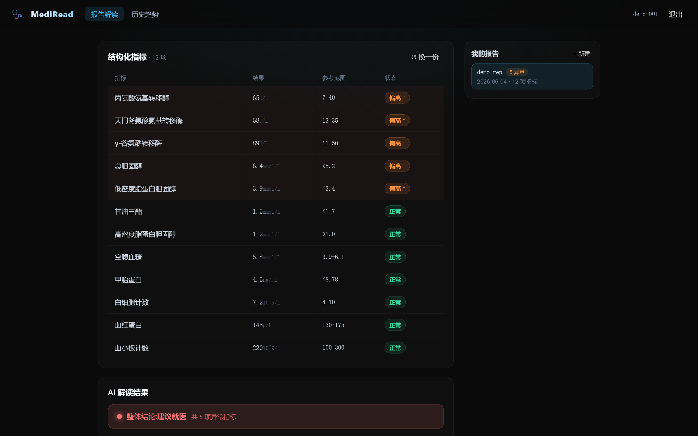
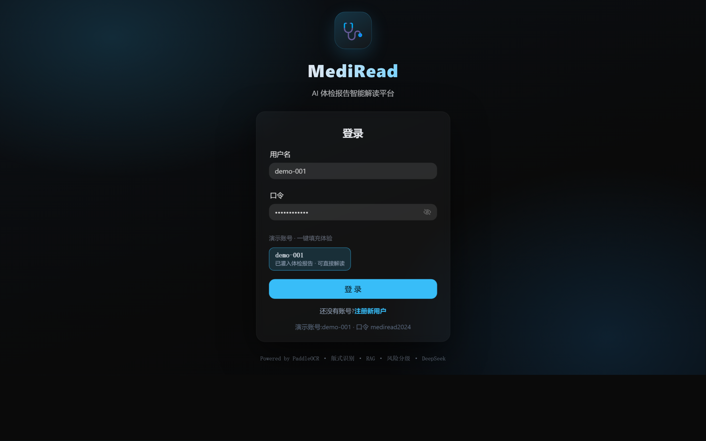
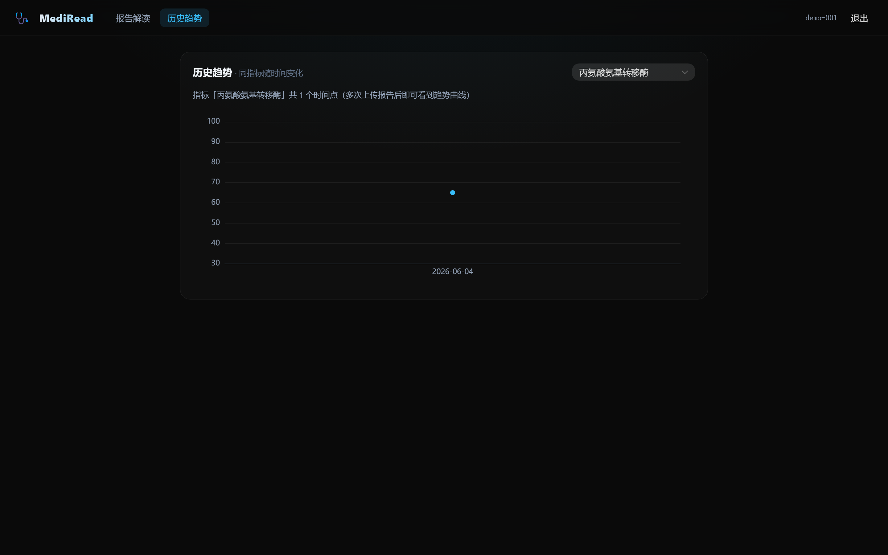

# MediRead · AI 体检报告智能解读平台

> **MediRead** is an AI platform that turns medical check-up reports (image / PDF) into a structured, plain-language interpretation — covering blood routine, urinalysis, liver / kidney function, lipid & glucose panels, tumor markers and more.
>
> Built with **FastAPI · LangChain · Ollama · PaddleOCR · Milvus · MySQL · MinIO**.

[](https://www.python.org/)
[](https://fastapi.tiangolo.com/)
[](https://github.com/PaddlePaddle/PaddleOCR)
[](LICENSE)

---

## 界面预览 | Screenshots

<p align="center">
  <br/>
  <sub>上传体检报告(图片 / PDF)→ PaddleOCR 指标识别 → 结构化指标表(异常标红)+ RAG 接地解读 + 风险分级</sub>
</p>

<table>
  <tr>
    <td width="50%" align="center">
      <br/>
      <sub>登录 · JWT 鉴权(bcrypt 预哈希 + 失败锁定)· 演示账号一键体验</sub>
    </td>
    <td width="50%" align="center">
      <br/>
      <sub>历史趋势 · 同一指标随多次报告的时间变化曲线</sub>
    </td>
  </tr>
</table>

> 前端为 Vue 3 + Naive UI 演示层(深色高级风),直观呈现后端 OCR + RAG 解读能力;项目重心与工程实绩在后端。

---

## 项目背景 | Background

用户拿到体检报告后，常面临三大痛点：
- **几十项指标看不懂**，专业术语晦涩
- **异常指标含义难判断**，单项偏离≠真实风险
- **医院专家解读预约难且贵**，时效差

**MediRead** 用户上传体检报告（图片 / PDF），AI 自动完成「指标识别 → 异常解读 → 生活建议 → 就医分级」，覆盖血常规、尿常规、肝肾功能、血脂血糖、肿瘤标志物等常见检验项目。

> Patients receive dense, jargon-heavy medical reports without context. MediRead ingests the report (image / PDF), extracts indicators with OCR, retrieves authoritative medical knowledge, and produces a tiered risk interpretation with lifestyle and triage recommendations — all running on a privately-deployed LLM.

---

## 核心能力 | Key Features

| 智能体 / Agent       | 能力 / Capability                                                                                    | 版本 |
| -------------------- | ---------------------------------------------------------------------------------------------------- | ---- |
| **报告解析 Agent**   | 图片 / PDF 双格式输入 · PaddleOCR + 版式识别 · 6 字段抽取 · 指标归一化 + 同义词映射 · 结构化 JSON 归档 | `v1.0` ✅ |
| **医学解读 Agent**   | 医学知识库 RAG · 多指标联合分析 · ReAct 推理 · 四级风险分级 · 就医分级 · 危急值兜底                  | `v1.0` ✅ |
| **健康管家 Agent**   | LangGraph 多 Agent 编排 · 多轮记忆 · 用户健康档案 · APScheduler 主动复查提醒 · FAQ 兜底               | `v1.2` 🚧 ([Roadmap](#-roadmap--路线图)) |

---

## 系统架构 | Architecture

```
                ┌─────────────────────────────────────────────────────────┐
                │                  FastAPI Gateway (API)                  │
                │           /upload  /parse  /interpret  /history         │
                └────────────────────────┬────────────────────────────────┘
                                         │
                ┌────────────────────────▼────────────────────────────────┐
                │              报告解析 Agent (Parser)                   │
                │  PaddleOCR ──▶ 版式识别 ──▶ 6 字段抽取 ──▶ 归一化      │
                │  指标名/数值/单位/参考范围/性别/年龄 → 结构化 JSON     │
                └────────────────────────┬────────────────────────────────┘
                                         │
                ┌────────────────────────▼────────────────────────────────┐
                │              医学解读 Agent (Interpreter)              │
                │  RAG (BM25+BGE+RRF+Cross-Encoder) ──▶ 多指标联合分析    │
                │  ReAct 多步推理 ──▶ 四级风险 ──▶ 就医分级 ──▶ 兜底     │
                └────────────────────────┬────────────────────────────────┘
                                         │
                ┌────────────────────────▼────────────────────────────────┐
                │ Milvus (向量) · MySQL (业务) · Redis (缓存) · MinIO     │
                │ Ollama (GLM-4-9B-Chat 量化版，本地部署，零外传)         │
                └─────────────────────────────────────────────────────────┘
```

详细架构图见 [`docs/architecture.md`](docs/architecture.md)。

---

## 技术栈 | Tech Stack

- **OCR**：PaddleOCR + 版式识别
- **Agent**：LangChain (ReAct) + StructuredTool
- **大模型**：Ollama 私有化部署 GLM-4-9B-Chat 量化版 — **健康数据零外传**
- **RAG**：BM25 + BGE 向量 多路召回 + RRF 融合 + Cross-Encoder 精排
- **后端**：FastAPI · Pydantic · Tortoise-ORM
- **数据 / 存储**：MySQL · Redis · MinIO · Milvus
- **部署**：Docker · docker-compose

---

## 目录结构 | Project Layout

```
MediRead/
├── app/
│   ├── main.py                 # FastAPI 入口
│   ├── config.py
│   ├── agents/
│   │   ├── parser/             # 报告解析 Agent
│   │   │   ├── ocr.py          # PaddleOCR 调用
│   │   │   ├── layout.py       # 版式识别 (国内主流医院模板)
│   │   │   ├── extractor.py    # 6 字段抽取
│   │   │   ├── normalizer.py   # 指标归一化 + 同义词映射
│   │   │   └── schemas.py
│   │   └── interpreter/        # 医学解读 Agent
│   │       ├── react_chain.py  # ReAct 多步推理
│   │       ├── joint_analysis.py # 多指标联合
│   │       ├── risk_grading.py # 四级风险 + 就医分级
│   │       └── prompts.py
│   ├── rag/                    # 通用 RAG 组件
│   │   ├── ingestion.py
│   │   ├── hybrid_retrieval.py
│   │   └── reranker.py
│   ├── api/
│   ├── core/                   # LLM / Embedding / DB / Storage
│   ├── data/
│   │   └── synonyms.json       # 指标别名词典
│   └── schemas/
├── frontend/                  # Vue 3 + Vite + Naive UI 前端(深色主题,前后端分离)
│   ├── src/
│   │   ├── views/             # 登录 / 报告解读 / 历史趋势
│   │   ├── components/        # 指标表 / 解读卡片 / ECharts 趋势图
│   │   ├── stores/            # pinia · JWT 鉴权态
│   │   └── api/               # axios + JWT 拦截器
│   └── vite.config.ts         # 开发期 /api 代理到 :8000
├── docs/
├── scripts/
├── tests/
├── docker-compose.yml
├── requirements.txt
└── .env.example
```

---

## 快速开始 | Quick Start

> 完整的「个人电脑 / 企业私有化服务器」部署文档（含信创 / 离线 / 医疗数据合规清单）见 **[`docs/DEPLOYMENT.md`](docs/DEPLOYMENT.md)**。
> 下面是 6 行命令快起版本。

```bash
git clone https://github.com/Mrduan-cloud/MediRead.git && cd MediRead
cp .env.example .env                                         # 编辑 JWT_SECRET_KEY / 密码
docker compose up -d                                         # 拉起 MySQL/Redis/Milvus/MinIO/Ollama/API
docker compose exec ollama ollama pull glm4:9b-chat-q4_0    # 拉取本地 LLM (~6GB，关键)
docker compose exec api python -m scripts.seed              # 初始化 DB + 医学 KB + Demo 报告
docker compose exec api python -m scripts.demo              # 跑端到端 demo
```

打开：

- Swagger 文档: <http://localhost:8000/docs>
- 健康探测: <http://localhost:8000/ready>
- MinIO 控制台: <http://localhost:9001>
- Prometheus 指标: <http://localhost:8000/metrics>

### 前端 / Frontend

后端起在 `:8000` 后,另开一个终端跑前端(Vue 3 + Vite,前后端分离,无需上云):

```bash
cd frontend
pnpm install
pnpm dev            # → http://localhost:5173 (开发期 /api 自动代理到 :8000)
```

演示账号 `demo-001` / `mediread2024`(已随 `scripts.seed` 灌入一份体检报告,登录即可一键解读)。
前端说明见 **[`frontend/README.md`](frontend/README.md)**。

### 推荐配置 / Hardware

| 场景             | CPU      | 内存       | 磁盘            | GPU                              | 模型                            |
| ---------------- | -------- | ---------- | --------------- | -------------------------------- | ------------------------------- |
| 个人电脑开发     | 8 核+    | 32 GB      | 200 GB SSD      | 可选 (CPU 也能跑，单页 10–30s)   | glm4:9b-chat-q4_k_m             |
| **小公司生产 ⭐**| 16 核    | 64 GB      | 500 GB+ SSD     | **单卡 RTX 4090 24G**            | **GLM-4-9B-Chat GGUF Q4_K_M**   |
| 中型企业生产     | 16 核    | 128 GB     | 1 TB+ SSD       | A10 24G / L20 48G / A100 40G+    | 同上 / 升级到 9B FP16 / 14B     |

> 默认面向**小公司私有化**场景：单卡 RTX 4090（约 2 万整机）+ GLM-4-9B-Chat Q4_K_M (Ollama)，单一医院/体检中心私有化部署即可回本。
> 硬件成本对照、ROI 测算、按公司阶段选配指南：[`docs/HARDWARE.md`](docs/HARDWARE.md)
> ⚠️ **医疗数据合规**：MediRead 处理敏感健康数据，生产部署必须严格遵循
> [`docs/DEPLOYMENT.md` §3.5 医疗数据保护清单](docs/DEPLOYMENT.md)。

---

## 关键设计要点 | Design Highlights

### 1. 多模板 OCR 解析

- **图片 / PDF 双格式**输入
- **PaddleOCR + 版式识别**适配国内主流医院与体检中心的报告模板
- 抽取 6 类核心字段：`指标名 / 数值 / 单位 / 参考范围 / 性别 / 年龄`
- **Pydantic + JSONSchema 强约束**输出结构化 JSON，归档 MinIO

### 2. 指标归一化与同义词映射

针对中英文别名做归一化，跨报告指标对齐 → 支持多次报告趋势对比与异常自动标记：

| 别名                | 标准名                |
| ------------------- | --------------------- |
| GGT                 | γ-谷氨酰转移酶        |
| HDL-C               | 高密度脂蛋白胆固醇    |
| ALT (GPT)           | 丙氨酸氨基转移酶      |
| AST (GOT)           | 天门冬氨酸氨基转移酶  |

词典源：公开医学词典 + 自建别名词典。

### 3. 多指标联合分析

单一指标异常与多指标联合异常采用**不同**解读策略，避免「单指标偏离一律打高风险」误判：

> 例：`ALT + AST + GGT` 三项联动判定肝损伤迹象。

基于 LangChain ReAct 模式编排 LLM 多步推理。

### 4. 风险分级 + 就医分级

| 风险等级       | 触发条件                       | 建议            |
| -------------- | ------------------------------ | --------------- |
| 轻度偏离       | 单项轻度超界 / 参考下限附近    | 调整饮食与作息  |
| 关注观察       | 多项轻度偏离 / 单项中度偏离    | 1–3 个月复查    |
| 建议复查       | 单项明显偏离 + 关联指标异常    | 2–4 周复查      |
| 建议就医       | 危急值 / 多项联动重度异常      | 全科 / 专科     |

**危急值兜底**（如肿瘤标志物显著升高）强制触发「建议尽快就诊专科」话术。

### 5. 私有化部署 — 健康数据零外传

通过 **Ollama 私有化部署 GLM-4-9B-Chat 量化版**，所有用户体检数据均在内网处理，不出本地。

---

## API 一览 | API Overview

| 路径                          | 方法 | 说明                            |
| ----------------------------- | ---- | ------------------------------- |
| `/api/auth/login`             | POST | 登录 → 签发角色化 JWT           |
| `/api/auth/register`          | POST | 自助注册（随注册下发 token）    |
| `/api/auth/demo-accounts`     | GET  | 演示账号列表（登录页一键体验）  |
| `/api/upload`                 | POST | 上传体检报告（image / pdf）     |
| `/api/parse/{report_id}`      | POST | 触发 OCR 解析与结构化抽取       |
| `/api/interpret/{report_id}`  | POST | 触发医学解读 + 风险分级         |
| `/api/history/reports`        | GET  | 我的报告列表（含异常计数）      |
| `/api/history/report/{id}`    | GET  | 单份报告详情（指标 + 最近解读） |
| `/api/history/series`         | GET  | 多次报告同指标趋势              |

完整 schema 见 `/docs` (Swagger UI)。

---

## 知识库 | Knowledge Base

- 《中国成人体检基本项目专家共识》
- 《临床检验项目大全》
- 公开权威医学指南与共识

元数据增强：`检验项目 / 系统分类 / 风险等级 / 适用人群`。

检索链：**BM25 + BGE 向量混合检索 → RRF 融合 → Cross-Encoder 精排**。

---

## 🗺️ Roadmap · 路线图

把"单次报告解读"型产品继续延伸为"长期健康陪伴"型产品。重点是把"健康管家 Agent" 接进来——
它**不替代**「医学解读 Agent」，而是把后者作为工具调用，并新增 *long-running memory / proactive scheduling / multi-agent orchestration* 三类能力。

| 月份 | 里程碑 | Release |
|---|---|---|
| 2025-09 | **Web 上传页** · Vue3 + Vite 拖拽上传 / PDF & 图片预览 / 上传进度 / 解读结果展示 | `v1.1.0` |
| 2025-10 | **健康管家 Agent** · LangGraph 多 Agent 编排 + 多轮记忆 + 主动复查提醒（headline） | `v1.2.0` |
| 2025-11 | **历史报告趋势对比** · 同用户多次报告的指标趋势图 + 异常变化高亮 | `v1.3.0` |
| 2025-12 | **多模态影像解读** · 拓展到 CT / MRI / 超声报告 | `v1.4.0` |

### 健康管家 Agent · 设计概览（2025-10）

形成 *原始数据 → 单次解读 → 长期陪伴* 的三段式闭环：

```
                ┌────────────────────────────────────────────────┐
                │              健康管家 Agent (Concierge)         │
                │     LangGraph: 意图识别 → 多路由 → 工具聚合      │
                └─────────────┬──────────────────────────────────┘
                              │
       ┌──────────────────────┼──────────────────────┐
       │                      │                      │
┌──────▼───────┐  ┌───────────▼─────────┐  ┌────────▼─────────┐
│  报告追问     │  │  复查提醒(主动)      │  │  健康咨询/FAQ     │
│ → 医学解读    │  │  APScheduler 定时    │  │  → 医学知识 RAG   │
│   Agent      │  │  扫描"建议 N 月后    │  │  + 产品 FAQ KB    │
│  + 历史档案  │  │  复查"标签 → push    │  │                  │
└──────────────┘  └──────────────────────┘  └──────────────────┘
```

**核心差异化**：
- **多轮记忆 + 用户档案**：把历次报告解读结果 / 风险等级 / 就医建议沉淀为长期用户健康档案（Redis 短期 + MySQL 长期画像），每次对话自动加载最近 N 份报告 + 用户偏好
- **LangGraph 路由编排**：意图识别（报告追问 / 复查提醒 / 健康咨询 / 数据查询）→ 通过 `StructuredTool` 调用 报告解析 Agent / 医学解读 Agent / 历史档案查询；非业务问题走 FAQ RAG 兜底；危急医学问题再次触发"建议就医"兜底
- **主动追踪与提醒**：基于医学解读 Agent 给出的"建议 N 月后复查"标签，通过 APScheduler + Celery 定时任务到期前主动 push 提醒，自动加载历次报告作为上下文，支持用户回复后无缝转人工

**新增依赖**：`APScheduler` / `Celery`（定时任务）· `WebSocket`（主动推送）· `redis-py`（增强用)

> 设计文档完整版见 [`docs/concierge-agent-design.md`](docs/concierge-agent-design.md)（10 月落地时同步发布）。

---

## License

[MIT](LICENSE) © 2024-2025 Mrduan-cloud
